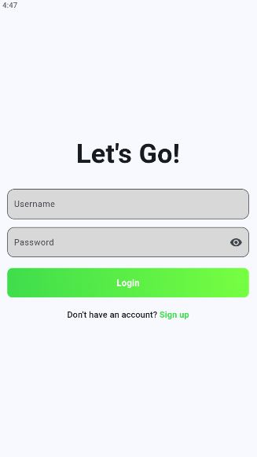
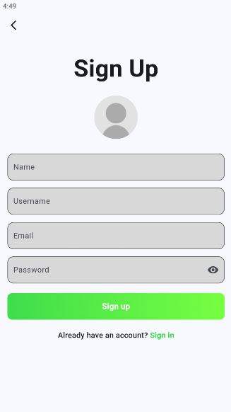
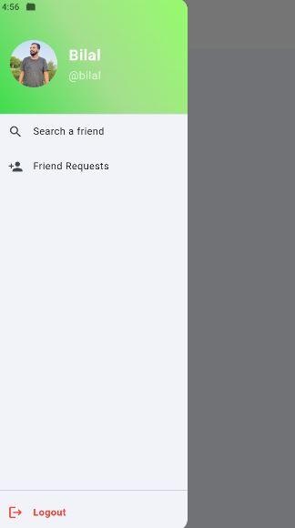
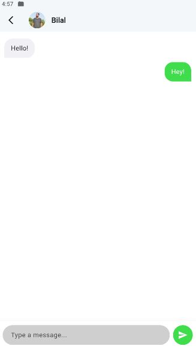

# 🔥 Flutter Chat App

A beautiful and functional real-time chat application built with **Flutter**, using **Firebase** for authentication & real-time messaging, and **Cloudinary** for profile image uploads.

---

## 🚀 Features

- 🔐 **User Authentication** (Firebase)
  - Sign up and login functionality
  - Profile picture upload via Cloudinary

- 💬 **Real-time Chat**
  - Chat with added friends
  - View conversation history
  - Firebase Firestore as backend

- 🧑‍🤝‍🧑 **Social Features**
  - Send & manage friend requests
  - Accept or reject pending requests
  - Search for users by username

- 🏠 **User Interface**
  - Modern UI design
  - Chat list (home screen)
  - Chat screen with message bubbles
  - Gradient buttons

---

## 🛠️ Technologies Used

- **Flutter** (Dart)
- **Firebase Authentication**
- **Firebase Firestore**
- **Cloudinary** (image upload)
- `image_picker`, `http`

---

## 📷 Screenshots

Login Page

Signup Page

Home Page

Home Page Drawer

Chat Screen

Search Friend

Pending Request
---

